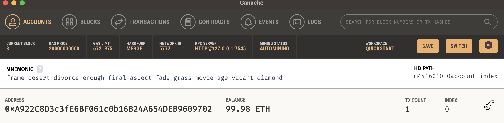
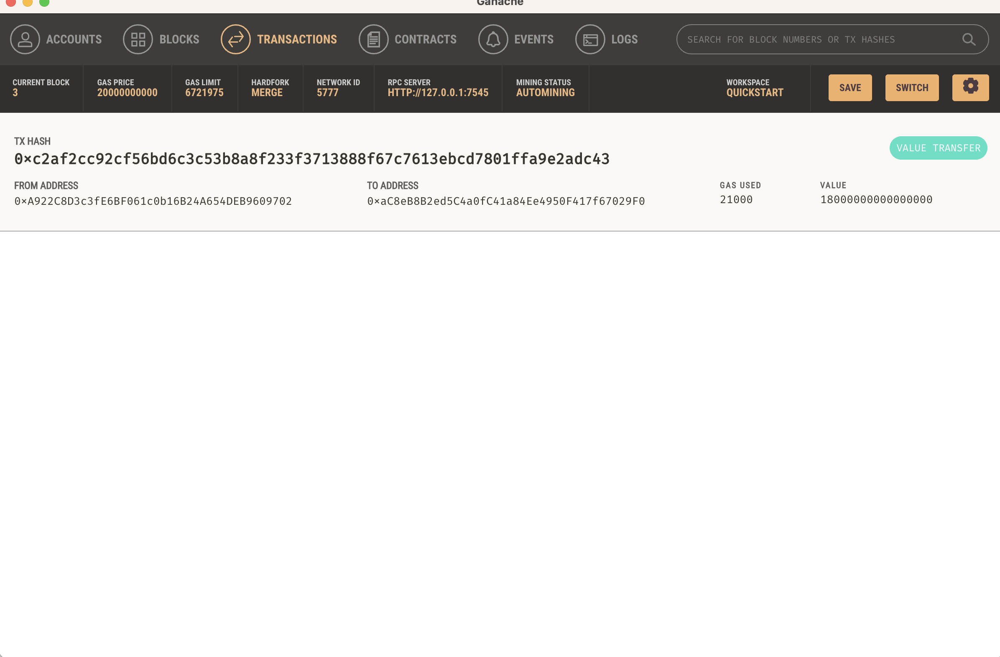
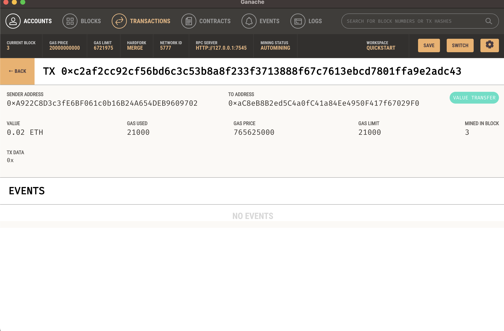

# Fintech Finder

This project involves integrating two Python files, fintech_finder.py and crypto_wallet.py, to automate tasks related to Ethereum transactions within the Fintech Finder application. The fintech_finder.py file provides the web interface for the application using the Streamlit library. The crypto_wallet.py file contains Ethereum transaction functions developed during this module's lessons.

_Last Updated: 2023-08-01_

---

## Technologies

This project leverages the following technologies:

- **Programming Language:** Python
- **Libraries:** Streamlit, DataClasses, Typing, Web3.py, os, requests, dotenv, bip44

---

## Installation Guide

If you don't have Python or Anaconda installed on your operating system:

- **[Install Python](https://www.python.org/downloads/)**
- **[Install Anaconda](https://docs.anaconda.com/free/anaconda/install/index.html)**

Follow the steps below to set up the development environment:

**1. Conda 'dev' Environment** - To run the main application, activate the 'dev' environment in your Anaconda installation using the following command:

```shell
conda activate dev
```

If you don't have a 'dev' environment or are unsure about it, create a new one with the following command and then activate it as shown above:

```shell
conda create -n dev python=3.8 anaconda
```

**2. Libraries Installation** - Ensure that the required libraries mentioned in the Technologies section above are installed in your environment. You can install them manually or use the `requirements.txt` file (if present) to install all dependencies at once.

**3. Clone Repository** - Clone this repository to your local machine. Navigate to the directory where you want to clone the repository and use the following command:

```shell
git clone 'repository link here'
```

Navigate into the repository folder using the following command:

```shell
cd 'repository name here'
```

---

## Usage

To use the Fintech Finder Ethereum Integration, ensure that you have Python and the required libraries installed. Then follow the steps below:

1. **Navigate to the repository folder**: Change your current directory to the cloned repository's directory:

```shell
cd <repository-name>
```

2. **Run the application**: Use the Streamlit library to run the application with the following command:

```shell
streamlit run fintech_finder.py
```

3. **Interact with the application**: Follow the on-screen instructions to experience the Ethereum-integrated Fintech Finder application. As a Fintech Finder customer, you can generate Ethereum accounts, fetch balances, calculate and execute payments to hired fintech professionals.

Ensure you are in the correct directory and that the file "fintech_finder.py" is present.

---

## Screenshots







---

## References

- [Streamlit Documentation](https://docs.streamlit.io/library/)
- [Web3.py Documentation](https://web3py.readthedocs.io/en/stable/)
- [Ganache](https://www.trufflesuite.com/ganache)

---

## Summary

The Fintech Finder Ethereum Integration marks a significant leap forward in the realm of fintech hiring and compensation. This application seamlessly connects customers with fintech professionals, enabling instant cryptocurrency payments using Ethereum blockchain technology. Built with Python and key libraries like Streamlit and Web3.py, the app demonstrates the fusion of modern fintech and blockchain capabilities. By following the installation and usage instructions, users can experience firsthand the future of streamlined financial transactions. 

---

## *Contributors*

**Rosalinda Olvera Fernandez**

[GitHub](https://github.com/rolvera05) - rolvera98271@gmail.com 
